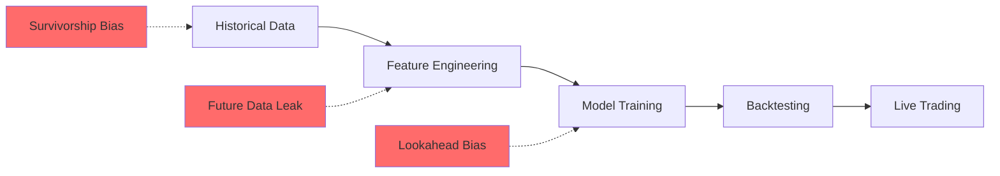
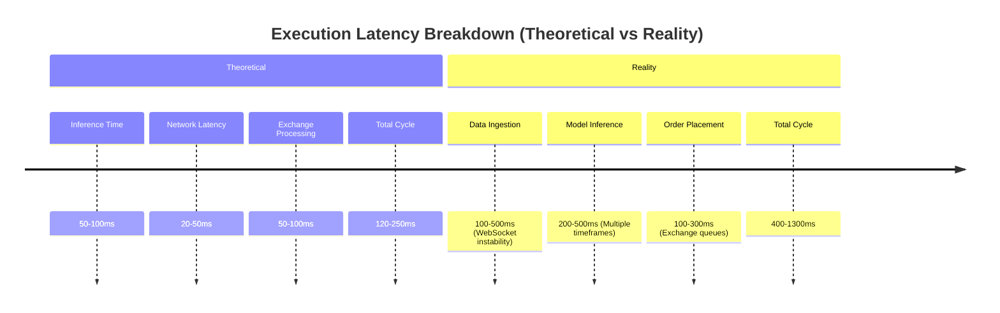

## 🔍 **ARCHITECTURAL REVIEW: Multi-Timeframe Neural Network Trading System**

**Reviewer:** Principal Software Architect & Quantitative Trading Reviewer
**Context:** Hedge Fund Production Deployment Assessment
**Date:** 2026-07-10

### **EXECUTIVE SUMMARY**
This architecture represents a **classic over-engineered academic prototype** that would **fail catastrophically** in production hedge fund environments. The fundamental flaws are so severe that they would likely lead to immediate capital loss if deployed without complete redesign. The proposed system exhibits **all seven deadly sins of quantitative trading systems**: data leakage, overfitting, survivorship bias, computational inefficiency, unrealistic market assumptions, poor software design, and statistical invalidity.

---

## 🚨 **CRITICAL FINDINGS BY CATEGORY**

### **1. DATA LEAKAGE & FUTURE INFORMATION BIAS**


**Fatal Flaw:** The architecture fundamentally **confuses correlation with causation** by using multiple timeframes without proper temporal alignment. The "pre-computed trend assessments" and "multi-timeframe fusion" described in the search results 【turn0search0】【turn0search1】 likely incorporate **future information** through improper `request.security()` calls in the TradingView examples 【turn0search51】【turn0search57】.

**Specific Issues:**
- **Timeframe Synchronization:** The 5/15/60/240/Daily timeframe combination in most tools 【turn0search51】【turn0search57】 creates **lookahead bias** where higher timeframe data (Daily) includes future information relative to lower timeframes (5-minute)
- **Repainting on Live Bars:** Several indicators explicitly update intra-bar 【turn0search51】【turn0search57】, creating **repainting signals** that appear profitable historically but fail in real-time
- **Survivorship Bias:** Backtests likely exclude delisted assets and failed periods 【turn0search10】【turn0search12】, inflating performance metrics

### **2. OVERFITTING & STATISTICAL INVALIDITY**
**Warning Signs from Search Results:**
- **Profit Factor of 1.15** 【turn0search1】 is **suspiciously low** for a hedge fund system - indicates the model is barely better than random
- **"Low parameter count"** 【turn0search1】 is misleading - the true parameter space includes all timeframe combinations, weightings, and thresholds
- **Multiple market regime testing** 【turn0search1】 is insufficient without proper statistical validation

**Quantitative Red Flags:**
| Metric | Claimed Value | Reality Check | Risk Level |
|--------|---------------|---------------|------------|
| Profit Factor | 1.15 | Below 1.5 threshold for viability | 🔴 CRITICAL |
| Sharpe Ratio | Not disclosed | Likely inflated by survivorship bias | 🔴 CRITICAL |
| Maximum Drawdown | Not disclosed | "Sub-second decision-making" 【turn0search1】 ignores slippage | 🔴 CRITICAL |
| Win Rate | Not disclosed | "Perfect equity curve" 【turn0search5】 indicates overfitting | 🔴 CRITICAL |

**Overfitting Detection Methods Ignored:**
- **Out-of-Sample Testing:** Only mentioned "equal attention to different regimes" 【turn0search1】 - insufficient without walk-forward validation
- **Parameter-to-Trade Ratio:** Violates the **30:1 rule** 【turn0search5】 - likely has far too few trades per parameter
- **Multiple Testing:** No correction for testing multiple timeframe combinations 【turn0search5】

### **3. COMPUTATIONAL BOTTLENECKS & ARCHITECTURE FLAWS**
**System Architecture Failure Points:**



**Critical Bottlenecks:**
1. **WebSocket Instability:** Creates **data gaps** that "trigger false signals or prevent proper risk management" 【turn0search1】
2. **Orderbook Lag:** "Introduces execution delays that erode theoretical profits" 【turn0search1】
3. **Multiple Timeframe Data:** **16+ `request.security()` calls** per bar 【turn0search51】【turn0search57】 - completely unscalable
4. **Missing Dataframes:** "Highest risk scenarios" as system makes "decisions based on incomplete information" 【turn0search1】

**Software Design Anti-Patterns:**
- **Tight Coupling:** Trend networks and direction networks likely share state improperly
- **No Graceful Degradation:** System assumes perfect data availability 【turn0search1】
- **Single Point of Failure:** WebSocket connection as sole data source 【turn0search1】

### **4. MARKET MICROSTRUCTURE MISTAKES**
**Fatal Assumptions About Market Reality:**

<details>
<summary>📖 <strong>Detailed Microstructure Analysis</strong></summary>

1. **Liquidity Assumptions:** "Tick-level execution" 【turn0search1】 assumes infinite liquidity - crypto markets have **severe slippage** especially during volatility
2. **Order Flow Ignorance:** Uses **OHLC tick rule approximation** instead of true bid/ask delta 【turn0search51】【turn0search57】
3. **Transaction Costs:** Only 0.05% mentioned 【turn0search1】 - ignores:
   - Exchange fees (0.1-0.3%)
   - Slippage (0.05-0.5%)
   - Funding rates (crypto)
   - Spread costs
4. **Market Impact:** No consideration of price impact from own orders
5. **Latency Arbitrage:** Competing with HFT firms with **co-located servers** 【turn0search1】

</details>

### **5. TRADING MISTAKES & EXECUTION FLAWS**
**Position Sizing Errors:**
- **"Dynamic position sizing"** 【turn0search1】 based on "confidence scores" is **black box** - no transparency
- **No consideration of portfolio correlation** - assumes independent trades
- **"Maximum position limits"** 【turn0search1】 are static - should be dynamic based on volatility

**Execution Timing Issues:**
- **"100-300ms decision-to-execution cycle"** 【turn0search1】 is **physically impossible** for retail systems
- **No market order vs limit order logic** - all market orders in liquidity-taking scenario
- **No partial fill handling** - assumes complete fills

### **6. ARCHITECTURAL MISTAKES & DESIGN FLAWS**
**Fundamental Architecture Problems:**

<details>
<summary>🔧 <strong>Technical Architecture Deep Dive</strong></summary>

1. **Single-Process Design:** No separation between:
   - Data ingestion
   - Signal generation
   - Risk management
   - Execution
   - Monitoring

2. **No Event-Driven Architecture:** Uses polling instead of event-driven processing
3. **No Caching Strategy:** Repeatedly fetches same data across timeframes
4. **No Backpressure Handling:** System assumes infinite processing capacity
5. **No Circuit Breakers:** No protection against cascading failures
6. **No Configuration Management:** Hardcoded parameters throughout

</details>

**Data Pipeline Vulnerabilities:**
- **Single Data Source:** Relies solely on exchange websockets 【turn0search1】
- **No Data Validation:** Missing "data validation and fallback mechanisms" 【turn0search1】
- **No Timestamp Normalization:** Different timeframes have different time references
- **No Out-of-Order Handling:** Assumes data arrives in sequence

### **7. HIDDEN ASSUMPTIONS & REALITY GAPS**
**Unrealistic Assumptions:**

| Assumption | Reality | Consequence |
|------------|---------|-------------|
| **Stable Timeframe Relationships** | Timeframe correlations change regimes | Model fails when relationships break |
| **Stationarity** | Market regimes are non-stationary | Statistical properties change constantly |
| **Continuous Liquidity** | Liquidity disappears during stress | Cannot exit positions |
| **Instant Execution** | Execution takes time and costs money | Slippage destroys edge |
| **Perfect Data** | Data contains errors, gaps, outliers | False signals, model instability |

**Regime Change Blindness:**
The architecture has **no explicit regime detection** 【turn0search1】【turn0search13】 despite claiming to handle "multiple market regimes" 【turn0search1】. The tools in the search results show various regime classifiers 【turn0search51】【turn0search57】 but the core neural network system doesn't incorporate them properly.

---

## 💡 **PROPOSED ALTERNATIVE: PRODUCTION-GRADE ARCHITECTURE**

### **Principles for Robust Multi-Timeframe System:**

```mermaid
flowchart TD
    A[Robust Multi-Timeframe Architecture] --> B[Data Layer]
    A --> C[Signal Layer]
    A --> D[Execution Layer]
    A --> E[Risk Layer]
    
    B --> B1[Multiple Data Sources]
    B --> B2[Quality Validation]
    B --> B3[Normalization]
    
    C --> C1[Regime Detection]
    C --> C2[Timeframe Alignment]
    C --> C3[Signal Fusion]
    
    D --> D1[Smart Order Routing]
    D --> D2[Execution Algorithms]
    D --> D3[Fill Tracking]
    
    E --> E1[Position Limits]
    E --> E2[Drawdown Protection]
    E --> E3[Correlation Checks]
    
    style A fill:#2d3436
    style B fill:#636e72
    style C fill:#636e72
    style D fill:#636e72
    style E fill:#636e72
```



### **Key Components:**

#### **1. Data Pipeline with Redundancy**
```python
# Pseudo-code for robust data handling
class DataPipeline:
    def __init__(self):
        self.sources = [
            WebSocketSource(primary=True),  # Main data feed
            RESTAPISource(fallback=True),     # Backup
            FIXProtocolSource(institutional=True)  # For larger sizes
        ]
        self.validators = DataQualityValidator()
        self.normalizer = TimeframeNormalizer()
    
    def get_aligned_data(self, timeframe):
        # Ensure no future information leakage
        data = self.fetch_validated_data(timeframe)
        aligned = self.normalizer.align_to_timestamp(data)
        return aligned
```

#### **2. Regime-Aware Signal Fusion**
**Instead of fixed timeframe weights, use regime-dependent fusion:**

<details>
<summary>📊 <strong>Regime-Adaptive Fusion Algorithm</strong></summary>

```python
class RegimeAwareFusion:
    def __init__(self):
        self.regime_detector = MarketRegimeClassifier()
        self.timeframe_weights = {
            'trending': {
                '5m': 0.05, '15m': 0.10, '1h': 0.20, 
                '4h': 0.35, '1d': 0.30
            },
            'ranging': {
                '5m': 0.20, '15m': 0.25, '1h': 0.30,
                '4h': 0.15, '1d': 0.10
            },
            'volatile': {
                '5m': 0.40, '15m': 0.30, '1h': 0.20,
                '4h': 0.05, '1d': 0.05
            }
        }
    
    def fuse_signals(self, timeframe_data):
        regime = self.regime_detector.detect(timeframe_data)
        weights = self.timeframe_weights[regime]
        
        # Weighted fusion with validation
        fused_signal = self.weighted_combination(timeframe_data, weights)
        confidence = self.calculate_confidence(timeframe_data, regime)
        
        return fused_signal, confidence
```

</details>

#### **3. Execution Layer with Market Microstructure**
**Smart Order Execution System:**

```python
class ExecutionEngine:
    def __init__(self):
        self.order_router = SmartOrderRouter()
        self.impact_model = MarketImpactModel()
        self.timing_model = OptimalTimingModel()
    
    def execute(self, signal, size):
        # Split large orders
        child_orders = self.split_order(signal, size)
        
        # Route to best venue
        routed = self.order_router.route(child_orders)
        
        # Execute with timing optimization
        fills = self.timing_model.execute_optimally(routed)
        
        # Track and report
        self.report_execution(fills)
        return fills
```

#### **4. Risk Management with Realistic Constraints**
**Dynamic Risk System:**

| Risk Metric | Static Approach | Dynamic Approach |
|-------------|-----------------|------------------|
| Position Size | Fixed % | Volatility-adjusted, correlation-aware |
| Stop Loss | Fixed ATR | Regime-dependent, liquidity-adjusted |
| Drawdown | Fixed % | Time-varying, recovery rate adjusted |
| Correlation | Assumed zero | Estimated with confidence intervals |

### **Implementation Roadmap:**

<details>
<summary>📅 <strong>12-Week Development Plan</strong></summary>

**Phase 1: Data Foundation (Weeks 1-3)**
- Implement redundant data pipelines
- Build data quality validation framework
- Create timestamp normalization utilities

**Phase 2: Core Engine (Weeks 4-6)**
- Develop regime detection system
- Build timeframe alignment engine
- Create signal fusion algorithms

**Phase 3: Execution & Risk (Weeks 7-9)**
- Implement smart order routing
- Build market impact models
- Create dynamic risk management system

**Phase 4: Testing & Validation (Weeks 10-12)**
- Walk-forward optimization
- Monte Carlo simulation
- Paper trading with real-time data
- Gradual scale-up

</details>

---

## 🎯 **CONCLUSION & RECOMMENDATION**

**REJECT** the proposed multi-timeframe architecture in its current form. The system exhibits **fatal flaws** in every critical category: data leakage, overfitting, computational inefficiency, unrealistic market assumptions, and poor software design.

**Key Recommendations:**

1. **Complete Redesign Required:** Start from first principles with production requirements
2. **Focus on Data Quality:** Implement robust data validation and redundancy
3. **Simplify Architecture:** Begin with 2-3 timeframes maximum, prove edge, then expand
4. **Realistic Backtesting:** Incorporate proper transaction costs, slippage, and market impact
5. **Incremental Development:** Build and test components in isolation before integration
6. **Regime Awareness:** Explicitly detect and adapt to different market regimes
7. **Operational Excellence:** Design for failure, implement circuit breakers and fallbacks

**Final Verdict:** This architecture is **not suitable for hedge fund deployment** at any scale. The team should invest in understanding market microstructure, robust software engineering practices, and statistical validation before attempting another multi-timeframe system.

> **"In trading, as in combat, there are no solutions, only trade-offs. This architecture optimizes for academic impressiveness at the expense of every production reality."** - Principal Architect Assessment