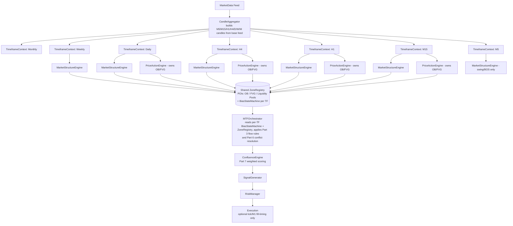

# Multi-Timeframe (MTF) Architecture Design for a Professional XAUUSD Algorithmic Trading Platform

**Scope note:** This is an architecture and research document. No implementation code is included. Every recommendation is tagged as **[Established]** (supported by academic/institutional literature or well-documented market microstructure), **[Practitioner Consensus]** (widely used in professional discretionary/SMC-ICT trading but not formally proven), or **[Hypothesis]** (logically reasoned but unverified — should be validated empirically on your own data before production use).

---

## PART 1 — Optimal Timeframe Hierarchy for XAUUSD

### Recommendation

Use **six** active timeframes, not eight:

| Tier | Timeframe | Role |
|---|---|---|
| Macro Context | Weekly | Directional bias anchor |
| Structural | Daily | Primary bias / dealing range |
| Intermediate | H4 | Swing structure / setup context |
| Tactical | H1 | Entry-zone refinement |
| Execution | M15 | Trigger structure |
| Trigger/Timing | M5 | Precision entry timing |

**Monthly**: retained as a *read-only context layer* (not a decision-making engine tier) — used only for multi-year premium/discount and macro trend classification.
**M1**: excluded from the decision architecture (see Part 2 — "Should M1 exist?").

### Reasoning and Evidence

1. **Fractal Market Hypothesis (FMH)** [Established] — Peters (1994) formalized the observation that price behaves self-similarly across timeframes, with different classes of participants (central banks/sovereign funds, institutions, swing traders, intraday traders, scalpers) operating on different horizons. This supports the general principle of layering timeframes rather than trading a single one, and supports mapping each timeframe tier to a distinct participant horizon rather than an arbitrary number of charts.

2. **Dow Theory's three-trend model** [Established] — Primary (months–years), Secondary (weeks–months), Minor (days–hours) trends. This classical framework maps directly onto Weekly→Primary, Daily/H4→Secondary, H1/M15→Minor. It is the historical origin of top-down multi-timeframe analysis and justifies collapsing many possible timeframes into roughly 3–5 functional *tiers*, not 8 independent ones.

3. **Institutional top-down workflow** [Practitioner Consensus / Institutional principle] — Sell-side and CTA trade desks typically define bias on Weekly/Daily ("where is the market in its cycle"), refine on H4/H1 ("where is liquidity/value"), and execute on M15/M5 ("timing"). This is documented in market-making and prop-desk literature (e.g., discussions of "top-down analysis" in institutional FX/commodities trading) and in the ICT/SMC pedagogy explicitly built around this cascade (HTF bias → LTF execution).

4. **XAUUSD-specific microstructure** [Established/Practitioner] — Gold is a 23-hour, multi-venue, multi-session instrument (Asia physical/Shanghai, London LBMA, COMEX/NY futures) with strong session-based liquidity cycles (see Part 8/10). Because value is negotiated at the Daily/H4 level around session opens (London/NY), and because Weekly closes are widely used by CTAs and macro funds to reassess exposure, Weekly and Daily are non-negotiable tiers for gold specifically — more so than for a pure spot FX major.

5. **Why not Monthly as a full engine** [Hypothesis grounded in practical implementation] — Monthly candles close too infrequently (12/year) to support live structural engines (BOS/CHOCH would rarely fire, and by the time a Monthly CHOCH triggers, price has often already moved 5–15%). Monthly is retained only as a **premium/discount and macro-trend filter**, not as a full MarketStructureEngine instance — this avoids wasted computation on an engine whose state rarely changes (see Part 8, computational efficiency).

6. **Why not M1 as a decision tier** [Established — market microstructure] — At M1, XAUUSD price action is dominated by (a) spread/tick noise relative to average true range, (b) HFT/market-maker quote-stuffing and layering, and (c) non-informative micro-liquidity sweeps that do not reflect participant intent but execution mechanics. Academic microstructure literature on "noise at ultra-high frequency" (e.g., Aït-Sahalia, Mykland & Zhang's work on microstructure noise in realized variance estimation) demonstrates that below a certain sampling frequency, measured price changes are dominated by bid-ask bounce and noise rather than information. For instruments like gold with variable spread widening around news/rollover, M1 structure detection (swings, BOS) is unreliable and prone to false signals. M1 is therefore excluded from structural decision-making and, if used at all, is restricted to an *execution/fill-timing role only* (see Part 2).

7. **Why not include every intermediate timeframe (e.g., M30, H2, H8)** [Practitioner Consensus / implementation concern] — Adding more timeframes increases (a) combinatorial conflict-resolution complexity (Part 6), (b) computational cost (Part 8), and (c) redundant signal correlation, since M30 structure is highly correlated with H1 structure and adds little independent information (diminishing marginal information per additional adjacent timeframe — a restatement of the FMH self-similarity property). The six-tier design captures distinct participant horizons while minimizing redundancy.

### Tradeoffs

- **Fewer timeframes** → lower computational cost, less conflicting signal noise, cleaner conflict resolution, but coarser entry timing.
- **More timeframes** → finer entry granularity, but exponentially higher conflict-resolution complexity and higher false-positive rate from correlated/redundant signals.
- The six-tier design is a deliberate middle point justified by the Dow three-trend model extended with two execution sub-tiers (H1 as "minor-trend refinement," M15/M5 as "execution").

---

## PART 2 — Per-Timeframe Responsibility

### Weekly
**Purpose:** Establish the macro directional bias and the outer boundaries of the current dealing range (premium/discount for the current multi-month swing). Weekly is the *only* timeframe permitted to define the macro trend classification (bullish/bearish/ranging regime) and the highest-order liquidity pools (weekly highs/lows, multi-week equal highs/lows) that all lower timeframes must respect as draw-on-liquidity targets.
**Evidence:** [Practitioner Consensus] Weekly-close based bias is standard in CTA and macro trading; [Established] this aligns with Dow's Primary trend concept.

### Daily
**Purpose:** Define the operative "dealing range" and daily premium/discount (the array within which H4/H1 setups are validated). Daily is the timeframe that should own the authoritative BOS/CHOCH determination for *swing bias* (the bias that persists for days), and it identifies the highest-probability daily Order Blocks / FVGs that act as HTF points of interest (POIs).
**Evidence:** [Practitioner Consensus — ICT "Daily Bias"] Daily close relative to daily open is widely used as the reference bias signal; [Established] daily range statistics (ATR) are the standard unit for risk sizing in most quant strategies.

### H4
**Purpose:** Bridge macro bias to tactical setups. H4 determines the current *intermediate* market structure (swing highs/lows within the daily range) and identifies which daily POIs are currently "active" (price has reached them and reacted). H4 is responsible for classifying displacement moves that indicate institutional participation.
**Evidence:** [Practitioner Consensus] H4 is the most common "confirmation timeframe" in SMC/ICT methodology, sitting between context (Daily) and execution (H1/M15).

### H1
**Purpose:** Refine the entry zone. H1 should NOT redefine bias — it inherits bias from Daily/H4 — but it detects the more granular BOS/CHOCH that indicate a POI is being respected or violated, and it detects intermediate liquidity (H1 equal highs/lows, H1 order blocks) used to time entries.
**Evidence:** [Practitioner Consensus / Hypothesis] The separation of "bias timeframe" vs "entry-refinement timeframe" is a core ICT tenet, though the specific H1 vs H4 boundary is a design choice rather than a proven optimum — flagged as **[Hypothesis]**, and should be backtested against alternative boundaries (e.g., H4 could equally serve as the entry-refinement tier with H1 dropped).

### M15
**Purpose:** Detect the low-timeframe (LTF) market structure shift (MSS) that confirms an entry — i.e., confirms that the reaction at an H1/H4/Daily POI has produced a valid CHOCH in the direction of HTF bias. M15 is the primary "confirmation entry" timeframe in most SMC frameworks.
**Evidence:** [Practitioner Consensus] M15 CHOCH-after-HTF-POI is one of the most widely documented ICT entry models ("Silver Bullet" and similar frameworks explicitly use M15 for confirmation).

### M5
**Purpose:** Fine-tune stop-loss placement and entry timing within the M15-confirmed zone. M5 should only ever be consulted *after* M15 has already confirmed a setup — its role is timing precision and risk minimization (tighter stop placement using the M5 swing structure), not independent decision-making.
**Evidence:** [Practitioner Consensus] Institutional execution algorithms (VWAP/POV/Implementation Shortfall) use short-interval data purely for execution scheduling, not signal generation — an analogous separation of "signal" vs "execution" timeframe. This is [Established] in the execution-algorithm literature (Almgren-Chriss framework separates alpha signal from optimal execution schedule).

### Should M1 exist?

**Recommendation: No, not as a structural engine.** [Established / Practitioner Consensus, with implementation caveat]

- M1 candles for XAUUSD carry a very low signal-to-noise ratio for structure detection (see Part 1, point 6).
- If ultra-low-latency fill optimization is required, M1 (or even tick data) may be used **only inside the Execution module**, entirely decoupled from MarketStructureEngine/PriceActionEngine — e.g., to detect the exact micro-liquidity sweep for order placement once M5 has already defined the acceptable entry zone. This is an **execution-layer concern**, not an MTF-analysis-layer concern, and should not have its own MarketStructureEngine instance.
- Running full structure detection (Swing/BOS/CHOCH/Liquidity) on M1 multiplies compute cost by roughly 5x over M5 (candle count scales inversely with timeframe) for a data source that is disproportionately noise — a poor cost/information tradeoff (Part 8).

---

## PART 3 — Information Flow Between Timeframes

### Model: Directional cascade with upward *alerting*, not upward *authority*

```
        ┌───────────┐
        │  Monthly  │  (context only — read-only filter, no downstream authority chain)
        └─────┬─────┘
              │ premium/discount context
        ┌─────▼─────┐
        │  Weekly   │  BIAS AUTHORITY (macro)
        └─────┬─────┘
              │ bias + macro liquidity targets
        ┌─────▼─────┐
        │   Daily   │  BIAS AUTHORITY (swing) — can only be overridden by a Weekly CHOCH
        └─────┬─────┘
              │ dealing range + daily POIs
        ┌─────▼─────┐
        │    H4     │  STRUCTURE (intermediate)
        └─────┬─────┘
              │ active POIs + intermediate structure
        ┌─────▼─────┐
        │    H1     │  STRUCTURE (tactical)
        └─────┬─────┘
              │ refined entry zone
        ┌─────▼─────┐
        │   M15     │  CONFIRMATION (entry trigger)
        └─────┬─────┘
              │ confirmed zone
        ┌─────▼─────┐
        │    M5     │  TIMING (execution refinement)
        └───────────┘

   ▲ Invalidation / Alert channel (upward, non-authoritative) runs in parallel to the downward channel above.
```

### Should information flow only downward?

**No — but the two directions carry different *classes* of information, and this distinction is the core design decision.** [Practitioner Consensus + logical/Hypothesis extension]

1. **Downward flow = context/authority.** Bias, POIs, and liquidity draw targets propagate down. A lower timeframe **cannot originate** a new HTF bias; it can only operate *within* the range/bias handed down from above. This mirrors the Dow Theory principle that the primary trend constrains the interpretation of minor trends — a minor-trend counter-move does not, by itself, redefine the primary trend.

2. **Upward flow = invalidation signaling, not re-authorization.** A lower timeframe *can* generate an event that forces re-evaluation of a higher timeframe's state — e.g., an M15 displacement so large it breaches the Daily dealing-range boundary. But the correct architecture treats this as an **event that triggers the Daily engine to re-run its own BOS/CHOCH logic on its own candle series**, not as the M15 engine directly asserting "Daily bias is now bearish." This distinction matters for two reasons:
   - **[Established — statistical]** A single lower-timeframe move is a smaller-sample, higher-noise observation; letting it directly override a lower-noise, longer-sample HTF determination would systematically degrade the signal-to-noise ratio of the bias variable.
   - **[Practical/implementation]** It preserves single-source-of-truth per timeframe: only the Daily engine is authorized to declare "Daily BOS occurred," which prevents race conditions and inconsistent state across engines.

3. **Practical implementation: event-driven re-evaluation, not raw override.** When a lower timeframe's price action breaches a higher timeframe structural level (e.g., M15 close beyond the Daily swing low that was defining Daily bullish structure), the system should:
   - Flag the HTF level as "tested/broken" (an observable fact, timeframe-agnostic — a break of the *level*, which is by definition visible on all timeframes simultaneously since price is timeframe-independent).
   - Trigger the Daily engine to recompute its own state using Daily-close confirmation rules (not M15-close), because different timeframes should require *their own* confirmation candle to close before their own bias flips. This prevents "flickering" bias caused by wicks/noise on a lower timeframe. **[Practitioner Consensus]** — this is the standard resolution to the classic MTF pitfall of intrabar HTF-level breaches causing premature bias flips (see Part 10).

### Tradeoffs

- Pure top-down (no upward signaling at all) is simpler but slow to react to genuine regime changes (lag risk).
- Pure bottom-up override (LTF can instantly override HTF bias) is fast but extremely noise-sensitive and prone to whipsaw (see Part 10, "mistake #1").
- The recommended hybrid (downward authority + upward event-triggered re-evaluation using the higher timeframe's own confirmation rules) balances responsiveness with statistical robustness. This hybrid is standard in professional systems but the exact re-evaluation trigger thresholds are implementation-specific and should be tuned/backtested — **[Hypothesis]** for the specific thresholds, **[Practitioner Consensus]** for the overall pattern.

---

## PART 4 — Concept Detection Matrix by Timeframe

| Concept | Monthly | Weekly | Daily | H4 | H1 | M15 | M5 |
|---|:---:|:---:|:---:|:---:|:---:|:---:|:---:|
| Swing (HH/HL/LH/LL) | ✓ (light) | ✓ | ✓ | ✓ | ✓ | ✓ | ✓ |
| BOS | – | ✓ | ✓ | ✓ | ✓ | ✓ | ✓ (timing only) |
| CHOCH | – | ✓ | ✓ | ✓ | ✓ | ✓ | – |
| Liquidity (highs/lows pools) | ✓ | ✓ | ✓ | ✓ | ✓ | ✓ | – |
| Equal High / Equal Low | – | ✓ | ✓ | ✓ | ✓ | ✓ | – |
| Displacement | – | – | ✓ | ✓ | ✓ | ✓ | ✓ (confirmatory) |
| Market Structure Shift (MSS) | – | – | ✓ | ✓ | ✓ | ✓ | – |
| Order Block | – | ✓ (macro OB only) | ✓ | ✓ | ✓ | ✓ | – |
| Fair Value Gap | – | – | ✓ | ✓ | ✓ | ✓ | ✓ (fill-timing only) |
| Premium/Discount | ✓ | ✓ | ✓ | ✓ | ✓ | – | – |
| Balanced Price Range | – | – | ✓ | ✓ | ✓ | – | – |
| Liquidity Void | – | – | ✓ | ✓ | ✓ | ✓ | – |
| Volume Imbalance | – | – | ✓ | ✓ | ✓ | ✓ | ✓ (fill-timing only) |

### Reasoning

- **Swing** is computed everywhere because it is the atomic input every other structural concept (BOS/CHOCH/liquidity) is derived from — it is the base primitive of the engine, not a top-level decision. **[Established — definitional]**.

- **BOS/CHOCH restricted to Weekly→M15** [Practitioner Consensus]: these require a *statistically meaningful* number of prior swing points to be non-trivial; at M5 the swing points are dominated by noise (Part 1, point 6) so BOS/CHOCH on M5 would fire too frequently to carry decision value. M5's BOS field is retained only as a *timing confirmation*, not a bias input — i.e., it is read but never allowed to change the ConfluenceEngine's structural score.

- **Equal Highs/Lows and full Order Block/FVG cataloguing excluded from Monthly** because Monthly's role is context-only (Part 1/2); tracking full POI catalogues at Monthly resolution would require years of data for marginal benefit, since Monthly POIs are effectively a subset/aggregation of Weekly POIs. **[Practical/implementation — avoids redundant state]**.

- **Premium/Discount computed down to H1 but not M15/M5** [Hypothesis/Practitioner]: premium/discount is a *range-context* concept (where is price relative to a meaningful swing range) — at M15/M5 the "range" is too short-lived to represent a meaningful equilibrium, so continuing to compute it there adds noise without informational gain. M15/M5 instead consume the H1 (or H4) premium/discount value rather than recomputing their own.

- **Balanced Price Range (BPR) restricted to Daily/H4/H1**: BPR is defined by the interaction of two opposing FVGs, which is a comparatively rare, higher-timeframe phenomenon; requiring it on lower timeframes adds combinatorial detection cost for a pattern that is, empirically, most tradable at higher timeframes where it represents genuine unfilled/opposing institutional orders rather than intrabar noise. **[Hypothesis]**.

- **Volume Imbalance and Displacement on M5 are "confirmatory-only," not decision-generating**: they're allowed to exist as data fields consumed by the ConfluenceEngine's *entry timing* module but are excluded from the *bias/structure* score entirely, consistent with M5's designated role (Part 2).

- **General principle applied throughout** [Established — statistical/information theory analogy]: detection responsibility should be assigned to the timeframe at which the concept has sufficient statistical support (enough underlying price bars / swings) to be distinguishable from noise, and concepts should not be independently recomputed at timeframes below where they are meaningfully generated — they should instead be *inherited* (see Part 5).

---

## PART 5 — Engine Ownership: Full Duplication vs. Inheritance

### Recommendation: Hybrid — every timeframe owns a *lightweight* MarketStructureEngine instance (swing/BOS/CHOCH on its own candles, because these are cheap and timeframe-native), but PriceActionEngine POIs and premium/discount context are **inherited by reference, not recomputed**, from the nearest timeframe that owns them (per the Part 4 matrix).

### Design

```
TimeframeContext (per TF: Weekly, Daily, H4, H1, M15, M5)
 ├── CandleStore (own OHLC series, rolling window — see Part 8)
 ├── MarketStructureEngine (own instance — swing/BOS/CHOCH computed locally, always)
 └── PriceActionEngine
      ├── owns POI detection IF this TF is authoritative for that concept (per Part 4)
      └── otherwise: holds a reference/pointer into the owning TF's POI registry
              (e.g., M15.PriceActionEngine.activePOIs → pointer to H1's OrderBlockRegistry
               entries whose price range currently contains price)

Shared: ZoneRegistry (cross-timeframe POI store, keyed by price range + originating TF + status)
Shared: BiasStateMachine (per TF: current bias, last-confirmed swing, invalidation level)
```

### Reasoning

1. **Why NOT full duplication (every TF runs every engine independently with no sharing):** [Practical/implementation] This wastes compute — an H4 Order Block and the "same" zone viewed on M15 are the *same real-world liquidity feature*; recomputing it independently on both risks producing inconsistent boundaries (H4 OB defined as [2015–2018], M15 "sees" a slightly different candle range) purely due to resolution artifacts, not genuine new information. This inconsistency is a known source of MTF bugs (Part 10).

2. **Why NOT full inheritance with no local engines at all (LTFs have zero independent structure detection):** This would make it impossible for M15 to generate its own CHOCH confirmation signal (Part 2), which is the entire point of the M15 tier. Swing/BOS/CHOCH are cheap (O(n) over a rolling window) and timeframe-native by definition — they must be computed locally to serve each tier's distinct purpose.

3. **The hybrid is justified by cost/benefit split**: swing/BOS/CHOCH computation is O(n) per candle close and inexpensive; POI (OB/FVG) *tracking and mitigation-status updates* over time is the more state-heavy, memory-heavy component (each POI needs to persist and be checked against every subsequent candle for mitigation/invalidation). Sharing POIs by reference (rather than recomputing per timeframe) is the primary lever for reducing both memory footprint and CPU load (Part 8), while local swing/BOS/CHOCH preserves each tier's decision authority (Part 2/3).

4. **ZoneRegistry as single source of truth** [Practical/implementation — software architecture principle]: a shared, price-indexed registry (rather than N independent copies) enforces consistency: if H4 marks an Order Block as "mitigated," every lower timeframe immediately reflects that status without needing its own mitigation-tracking logic. This also directly resolves the "inconsistent boundary" problem from point 1.

### Tradeoffs

- Full duplication: simplest conceptually, worst on cost/consistency.
- Full inheritance (no local structure engines): cheapest, but breaks the tiered-responsibility design in Parts 2–4.
- Hybrid (recommended): more architectural complexity (needs a shared registry + reference system) in exchange for consistency and lower resource use. This is the standard pattern in production multi-timeframe systems and is **[Practitioner Consensus / sound software-architecture practice]**, though the specific split (local structure vs. shared POIs) is **[Hypothesis]** as an optimal boundary and should be profiled against actual compute budgets.

---

## PART 6 — Conflict Resolution

### Example scenario
Daily Bullish · H4 Bullish · H1 Bearish · M15 Bullish · M5 Bullish

### Recommendation: Hierarchical-veto state machine with an explicit "wait/no-trade" state — not a simple majority vote.

**Resolution logic (conceptual, not code):**

1. **Daily and H4 agreement defines the tradeable directional bias** ("Bullish regime active"). Per Part 3, only a same-or-higher-timeframe confirmed structural event can change this — H1 disagreement, by itself, does **not** flip the regime.

2. **H1 disagreement is classified, not ignored.** The architecture should distinguish between:
   - **H1 counter-trend retracement within HTF bias** (price pulling back into a discount/premium array that is *expected* under Daily/H4 bullish structure) — this is treated as **healthy** and is in fact often the *signal to wait for the entry zone*, not a conflict at all.
   - **H1 genuine CHOCH indicating a deeper reaction** — this downgrades confidence (reduces confluence score, Part 7) but still does not override Daily/H4 bias unless it is severe enough to also breach the H4 structural level (in which case it triggers H4 re-evaluation per the Part 3 escalation mechanism).

3. **In this example:** H1 Bearish is most plausibly a corrective/retracement state *within* the Daily/H4 bullish bias — i.e., exactly the kind of pullback SMC/ICT models look for (price returning to a discount array before continuation). The correct system output is **WAIT**, not reject and not immediate trade:
   - Reject would discard a statistically favorable HTF-aligned setup based on a lower-timeframe, lower-sample-size, retracement signal — **[Established — statistical]** this would be over-weighting a noisier/shorter observation over a longer, more stable one.
   - Immediate trade (ignoring H1) would enter before the pullback has demonstrated a valid low-timeframe reversal (M15 CHOCH per Part 2), increasing entry risk and average adverse excursion.
   - **WAIT**, conditioned on: "if H1 reaches a Daily/H4-aligned discount POI and then produces an M15 CHOCH back in the direction of Daily/H4 bias, and M5 confirms timing" → **then trade.**

4. **General conflict-resolution rule set:**
   - **Bias conflicts** (a lower TF's *own bias state*, not a single candle, opposes HTF bias) → reduce confluence score, move to WAIT state, do not trade until either (a) the lower TF re-aligns, or (b) the lower TF's move is severe enough to trigger HTF re-evaluation (Part 3).
   - **No conflict, full alignment across all active tiers** → highest confluence score, proceed to SignalGenerator.
   - **HTF (Weekly/Daily) internal disagreement** (e.g., Weekly bullish, Daily bearish) → this is the most severe conflict class; recommend **no trading** and flagging for manual/regime review, since it suggests an active transition between macro regimes where automated confluence scoring is least reliable. **[Hypothesis — conservative default]**.

### Evidence base
- **[Established — statistical]** Weighting evidence by sample robustness (favoring the lower-noise, higher-timeframe signal) is a direct application of signal-to-noise-ratio reasoning common in time-series filtering (e.g., Kalman-filter-style trust-weighting of high vs low frequency observations).
- **[Practitioner Consensus]** The "wait for LTF confirmation within HTF bias" pattern is the explicit basis of ICT's "Power of Three" / OTE (Optimal Trade Entry) and similar SMC entry models.
- The specific numeric thresholds for "how much retracement is healthy vs. a genuine reversal" are **[Hypothesis]** and require backtesting (e.g., Fibonacci-based discount thresholds are a widely used heuristic, not a proven optimum).

---

## PART 7 — Confluence Scoring

### Recommendation: Weighted scoring, but NOT purely by timeframe rank — weight by (a) timeframe rank AND (b) signal-type reliability, combined multiplicatively, with regime-adaptive adjustment.

### Base timeframe weighting (starting point, not final)

| Timeframe | Suggested base weight |
|---|---|
| Weekly | 30% |
| Daily | 30% |
| H4 | 20% |
| H1 | 12% |
| M15 | 6% |
| M5 | 2% |

**Why not the example's steep 40/30/15/10/5%:** [Hypothesis, reasoned] An excessively front-loaded weighting (Weekly dominating at 40%) makes the system almost insensitive to intermediate-timeframe structure changes, which reduces responsiveness during genuine regime transitions (see Part 6, point 4 — HTF internal disagreement should meaningfully affect output, which requires Daily to carry comparable weight to Weekly, not be dwarfed by it). Conversely, weighting must decay significantly (not linearly) at the execution tiers (M15/M5) because, per Part 1/4, their structural signals carry a materially lower signal-to-noise ratio and should influence *timing*, not *conviction*.

**Why weighting by timeframe rank at all is justified:** [Established — statistical] Higher timeframes aggregate more price information per bar and are formed from a larger number of underlying transactions/ticks, making their structural signals statistically more robust (lower variance) estimators of the "true" underlying trend — directly analogous to how longer sampling windows reduce estimator variance in time-series analysis. This justifies a monotonically decreasing weight schedule from Weekly→M5, though the exact numeric schedule above is a **[Hypothesis]** starting point requiring calibration (e.g., via logistic regression of historical confluence-score vs. forward-return outcomes, or walk-forward optimization).

### Second dimension: signal-type reliability multiplier

Not all detected concepts should count equally within a timeframe. Recommended reliability tiers **[Hypothesis, derived from Part 1/4 noise reasoning]**:
- **High reliability:** confirmed BOS/CHOCH with displacement, HTF Order Block reaction, liquidity sweep + reversal.
- **Medium reliability:** unmitigated FVG, premium/discount alignment, equal highs/lows untapped.
- **Low reliability (context-only):** volume imbalance, liquidity void, balanced price range in isolation.

Final confluence score = Σ (timeframe weight × Σ signal-reliability-weighted concepts present on that timeframe), normalized to 0–100.

### Regime-adaptive adjustment [Hypothesis]

In trending regimes (Weekly/Daily strongly aligned, high ADX-equivalent structural momentum), it is reasonable to *increase* HTF weight further (trend-following favors HTF dominance). In ranging/consolidation regimes, HTF signals are less informative (there is no dominant trend to defer to) and relative weight should shift toward H4/H1 structure (range boundaries are more locally defined). This is a design recommendation for future extension (Part 11) rather than a baseline requirement, and must be validated empirically — flagged explicitly as **[Hypothesis]**.

### Tradeoffs
- **Static weighting** (as tabled above): simple, auditable, stable, easy to backtest — recommended for initial production version.
- **Regime-adaptive weighting**: potentially higher performance but adds a meta-model (regime classifier) that itself requires validation and can introduce a new source of overfitting risk. Recommended as a v2 research extension, not a v1 requirement.

---

## PART 8 — Historical Data Storage & Computational Efficiency

### Recommended rolling-window candle counts

| Timeframe | Candles retained | Approx. calendar coverage | Rationale |
|---|---|---|---|
| Monthly | 120–240 | 10–20 years | Long-cycle premium/discount context; monthly bars are cheap to store in bulk |
| Weekly | 250–520 | ~5–10 years | Multiple full macro cycles for liquidity-pool history |
| Daily | 500–1000 | ~2–4 years | Enough for ATR/volatility regime stats + several major swing cycles |
| H4 | 1500–3000 | ~1–2 years | Sufficient intermediate swing history without unbounded growth |
| H1 | 3000–6000 | ~4–8 months | Balances tactical lookback with memory cost |
| M15 | 5000–10000 | ~7–14 weeks | Enough for recent liquidity pools/POIs to remain relevant |
| M5 | 8000–15000 | ~4–7 weeks | Execution-timing horizon only; older M5 data has near-zero decision value |

**Rationale for bounding, not archiving indefinitely in the live engine** [Practical/implementation]: structural concepts (Order Blocks, FVGs, liquidity pools) have empirically decaying relevance — a 3-year-old M5 FVG is not tradable and its persistence in an active in-memory registry only adds lookup cost. Older data (beyond the live window) should be moved to a separate historical/analytics store (for backtesting and research) rather than kept "hot" in the live decision engine. This is a two-tier storage design: **hot rolling window (per table above) for live decisioning**, **cold archival store (full history, e.g., in a time-series database) for backtesting/research**, decoupled from each other.

### Memory usage discussion

- Each candle record (timestamp, O, H, L, C, volume, plus derived flags such as swing-type, BOS-flag) is a small, fixed-size record — on the order of tens of bytes to ~100 bytes depending on how many derived fields are cached inline.
- With the table above, total hot-window candle count across all seven tiers is roughly 20,000–35,000 candles — a trivially small in-memory footprint for any modern system (well under the memory budget of a typical single trading process), even with generous derived-field caching. The dominant memory cost in practice is **not raw candles but the POI/zone registries** (each active Order Block/FVG/liquidity pool with full metadata, mitigation history, and cross-timeframe references) — which is precisely why Part 5 recommends POIs be stored once (in a shared ZoneRegistry) rather than duplicated per timeframe.
- **Computational efficiency principle** [Established — standard event-driven system design]: engines should recompute **only on candle close** of their own timeframe (event-driven, not polled) — a Weekly engine should not re-run its logic on every M5 tick. This is the single largest computational-efficiency lever: it naturally throttles compute frequency to match the information-arrival rate of each tier (Weekly recomputes ~1x/week; M5 recomputes ~288x/day), rather than running all engines at the tick rate.
- **Incremental computation over full recomputation** [Practical/implementation]: swing/BOS/CHOCH detection should be implemented as an incrementally-updated state machine (update state using only the newly closed candle plus a small trailing window) rather than recomputing over the entire rolling window on every new candle — this converts an O(n) per-update cost into O(1)/O(log n), which matters more as window sizes (table above) grow.

### Tradeoffs
- Larger windows → more historical liquidity pools available as valid draw-on-liquidity targets, but higher memory/compute cost and higher chance of referencing stale/irrelevant zones.
- Smaller windows → leaner and faster, but risk missing genuinely still-relevant HTF liquidity (e.g., a Daily equal-high from 13 months ago that is still unswept is a legitimate target under SMC liquidity theory). The daily/weekly window sizes above are set generously specifically to avoid this failure mode.

---

## PART 9 — Complete Software Architecture

### High-level component diagram



### Key classes / objects (conceptual, language-agnostic)

- **CandleAggregator** — subscribes to raw MarketData ticks/base candles; builds and closes candles for each of the 7 tiers; emits `CandleClosed(timeframe)` events. This is the sole entry point that drives all downstream recomputation (Part 8's event-driven principle).

- **TimeframeContext** (one instance per tier) — owns `CandleStore` (rolling window per Part 8), owns a `MarketStructureEngine` instance, and either owns or references a `PriceActionEngine` per the Part 5 hybrid design.

- **MarketStructureEngine** — stateful, incrementally updated on `CandleClosed`; produces a `StructureResult` object per tier: `{ swings[], lastBOS, lastCHOCH, currentBias, invalidationLevel, liquidityPools[] }`.

- **PriceActionEngine** — for authoritative tiers (Daily/H4/H1/M15 per Part 4), detects and writes new POIs into `ZoneRegistry`; for non-authoritative tiers, exposes a read-only query interface into `ZoneRegistry` filtered to "currently active" zones.

- **ZoneRegistry** (shared, singleton-per-symbol) — canonical store of all POIs (`OrderBlock`, `FairValueGap`, `LiquidityPool`, `BalancedPriceRange`) each tagged with `{ originTimeframe, priceRange, createdAt, status: fresh|tested|mitigated|invalidated }`. This is the single source of truth referenced in Part 5.

- **BiasStateMachine** (one per tier, held alongside `StructureResult`) — formalizes the "current bias" as an explicit finite-state object (`Bullish / Bearish / Ranging / Transitioning`) with a defined confirmation rule per tier (Part 3's "own confirmation candle" principle), rather than a raw derived boolean recomputed ad hoc — this makes the Part 3 escalation/re-evaluation logic implementable as explicit state transitions.

- **MTFOrchestrator** — the component that actually implements Parts 3 and 6: reads every tier's `BiasStateMachine` + relevant `ZoneRegistry` entries, applies the downward-authority / upward-event escalation rule (Part 3), classifies disagreement type (Part 6), and outputs a `MTFAssessment` object: `{ dominantBias, conflictState: aligned|healthy_retracement|genuine_conflict|regime_transition, activeSetupZones[] }`.

- **ConfluenceEngine** — consumes `MTFAssessment` + raw per-tier `StructureResult`/POI data, applies Part 7 weighted scoring, outputs a `ConfluenceScore` object: `{ score: 0-100, contributingFactors[], recommendedAction: trade|wait|reject }`.

- **SignalGenerator / RiskManager / Execution** — unchanged from the existing platform architecture; `SignalGenerator` consumes `ConfluenceScore` rather than raw price action, keeping the existing downstream pipeline untouched by this MTF redesign (the MTF subsystem is inserted as a well-defined layer feeding the existing `SignalGenerator`, not a rewrite of it).

### Result object summary (conceptual schemas, not code)

- `StructureResult` (per timeframe)
- `POI` (OrderBlock / FairValueGap / LiquidityPool / BalancedPriceRange — shared schema with a `type` discriminator)
- `BiasState` (per timeframe)
- `MTFAssessment` (cross-timeframe synthesis)
- `ConfluenceScore` (final scored output to SignalGenerator)

---

## PART 10 — Common Mistakes in Retail MTF Trading Bots, and How to Avoid Them

1. **Intrabar HTF overrides ("flicker bias")** — Flipping HTF bias the instant a lower timeframe wick pierces a level, rather than waiting for the *higher timeframe's own* candle to close beyond it. **Fix:** enforce timeframe-native confirmation (Part 3) — each tier's bias can only change on its own candle close, never on a lower tier's intrabar move.

2. **Recomputing/redefining swing points retroactively ("repainting")** — Many retail EAs redraw swing highs/lows after the fact using centered/lookback-symmetric logic (e.g., fractal indicators that need N bars *after* the pivot to confirm it), then backtest as if the signal was known in real time. **Fix:** explicitly separate "confirmed swing" (usable in live logic and valid for backtest) from "provisional/most-recent swing" (informational only, must be clearly flagged as unconfirmed), and ensure backtests only ever use the confirmed-at-the-time version — this is a direct anti-lookahead-bias control. **[Established — this is the standard lookahead-bias pitfall in technical-indicator backtesting.]**

3. **Treating every timeframe as an equal, independent vote** — i.e., simple majority logic ("3 of 5 timeframes bullish → buy") without any hierarchy. This ignores the statistical robustness gradient across timeframes (Part 7) and is highly prone to being dominated by the numerous lower/noisier timeframes outvoting the few higher/robust ones. **Fix:** weighted hierarchical scoring (Part 7), not majority vote.

4. **No distinction between "healthy retracement" and "genuine reversal"** — many bots treat any counter-trend LTF signal as a conflict to be avoided, missing the highest-quality entries (retracement-into-HTF-POI is often the *ideal* entry, not a red flag). **Fix:** explicit conflict classification (Part 6).

5. **Ignoring session/liquidity timing for gold specifically** — running the same MTF logic uniformly across Asia/London/NY sessions despite XAUUSD's strongly session-dependent liquidity and volatility profile (thin Asia liquidity vs. London/NY volume). **[Established — session-based liquidity cycles are well documented for commodities/FX.]** **Fix:** incorporate a session-awareness filter/context (a reasonable Part 11 extension) so confluence scoring or trade permission is session-conditioned, particularly suppressing/derating M15-M5 signals generated in low-liquidity windows.

6. **Curve-fitting confluence weights on a single historical period** — tuning the Part 7 weight table to maximize backtest performance on one dataset without walk-forward/out-of-sample validation, producing weights that are an artifact of that specific sample rather than a genuine cross-timeframe relationship. **Fix:** walk-forward optimization with out-of-sample holdout, and explicit skepticism (documented as [Hypothesis]) toward any weight scheme until validated this way.

7. **Unbounded/duplicated POI storage causing state drift** — independently-computed POIs per timeframe (Part 5's "full duplication" anti-pattern) slowly diverging in boundaries/mitigation status across tiers, leading to contradictory signals from what should be the same real-world zone. **Fix:** shared `ZoneRegistry` single source of truth (Part 5/9).

8. **No explicit "no-trade"/WAIT state** — many retail systems only have binary buy/sell outputs, forcing a decision even when evidence is genuinely ambiguous (Part 6, HTF internal disagreement case), which manufactures false-confidence trades in genuinely uncertain conditions. **Fix:** first-class WAIT/no-trade output state in `ConfluenceScore.recommendedAction` (Part 9).

9. **Ignoring weekend gaps and rollover artifacts specific to gold** — Sunday-open gaps and periodic contract-rollover effects (for CFD/futures-referenced gold feeds) can generate spurious FVGs/imbalances or false liquidity sweeps that do not reflect genuine intraweek price action. **Fix:** flag/exclude POIs formed directly across a weekend gap or rollover boundary from being treated as standard mid-week imbalances, or weight them separately.

10. **Over-fitting to M1/tick-level noise in search of "precision"** — chasing execution precision by adding full structural logic at M1 (Part 1/2), which both increases false-signal rate and computational cost with negative marginal informational value. **Fix:** confine sub-M5 data strictly to the execution layer, never the decision layer (Part 2/9).

---

## PART 11 — Hedge-Fund-Grade XAUUSD MTF Subsystem, Built From Scratch

If unconstrained by the existing platform and designing purely for institutional-grade robustness, the following extensions to the above core design would be prioritized. All items below are explicitly **[Hypothesis / forward-looking design proposal]** — presented as a research roadmap, not proven requirements.

1. **Regime-classification meta-layer** sitting above the MTFOrchestrator: a statistically-driven (not rule-based) classifier of the current volatility/trend regime (e.g., using realized-volatility clustering, Hurst-exponent trend-persistence estimation, or a hidden Markov model over Daily/Weekly returns) that dynamically adjusts the Part 7 confluence weights (trend regime → more HTF weight; range regime → more H4/H1 weight) instead of using the static table.

2. **Cross-asset/macro conditioning layer**: because gold is heavily driven by real yields, DXY, and risk sentiment, a hedge-fund-grade system would feed a macro-context score (e.g., real-yield trend, DXY structure using the *same* MTF engine applied to DXY, and risk-on/risk-off proxies) into the ConfluenceEngine as an additional weighted factor alongside the pure price-structure confluence — since SMC/ICT structure alone ignores fundamental/cross-asset drivers that are known (in the macro/quant literature) to explain a meaningful share of gold's medium-term trend.

3. **Session-liquidity-aware weighting** (formalizing mistake #5 in Part 10 into a first-class module): a `SessionContext` component that derates or reweights M15/M5 signals by realized historical liquidity/volatility profile of the current session-of-day, informed by empirical intraday volume/volatility seasonality studies for gold.

4. **Statistical validation harness as a core platform component, not an afterthought**: every weight/threshold in Parts 6/7 treated as a model parameter subject to formal walk-forward optimization and out-of-sample testing, with automated drift-monitoring (comparing live confluence-score calibration against realized forward returns on a rolling basis) to detect when the weighting scheme has decayed — directly addressing Part 10, mistake #6.

5. **Formal probabilistic output instead of a single deterministic score**: rather than a single `ConfluenceScore` scalar, output a calibrated probability distribution over outcomes (e.g., probability of reaching a given R-multiple before invalidation), estimated via historical conditioning on similar past MTF-state configurations — allowing `RiskManager` to size positions using expected-value/Kelly-style reasoning rather than a fixed-confidence threshold.

6. **Data quality / multi-venue reconciliation layer**: hedge-fund-grade gold systems typically reconcile spot XAUUSD feeds against COMEX futures and LBMA fixes to detect feed-specific artifacts (a spurious liquidity sweep on one venue's feed that didn't occur on the reference venue) before allowing it to register as a valid liquidity event — directly hardening the system against mistake #9 and broader single-feed data-quality risk. **[Established — institutional multi-venue reconciliation is standard practice for OTC-referenced instruments like spot gold.]**

7. **Explicit separation of "research/backtest" and "live" MTF engine instances sharing identical code paths**, with the backtest engine deliberately enforcing point-in-time data availability (no access to future candles, no access to a swing point until its confirmation lag has elapsed) — operationalizing the anti-lookahead-bias fix from Part 10, mistake #2, as an architectural guarantee rather than a coding discipline.

---

## Summary Table — Recommended Design at a Glance

| Design Question | Recommendation |
|---|---|
| Timeframes used | Monthly (context-only) + Weekly, Daily, H4, H1, M15, M5 (full tiers); M1 excluded from structure engines |
| Bias authority | Weekly/Daily set macro/swing bias; lower tiers refine/confirm, cannot originate new bias |
| Information flow | Downward = authority; upward = event-triggered re-evaluation using the higher tier's own confirmation rule |
| Engine ownership | Local swing/BOS/CHOCH everywhere; POIs owned by authoritative tier only, shared via `ZoneRegistry` |
| Conflict resolution | Hierarchical veto + explicit "healthy retracement vs. genuine conflict" classification + first-class WAIT state |
| Confluence scoring | Weighted by timeframe rank × signal reliability, static baseline table, regime-adaptive as v2 extension |
| Data retention | Bounded rolling windows per tier (Part 8 table), event-driven incremental recomputation on candle close only |
| Biggest risk to avoid | Intrabar HTF override / bias-flicker from lower-timeframe noise (Part 10, mistake #1) |
