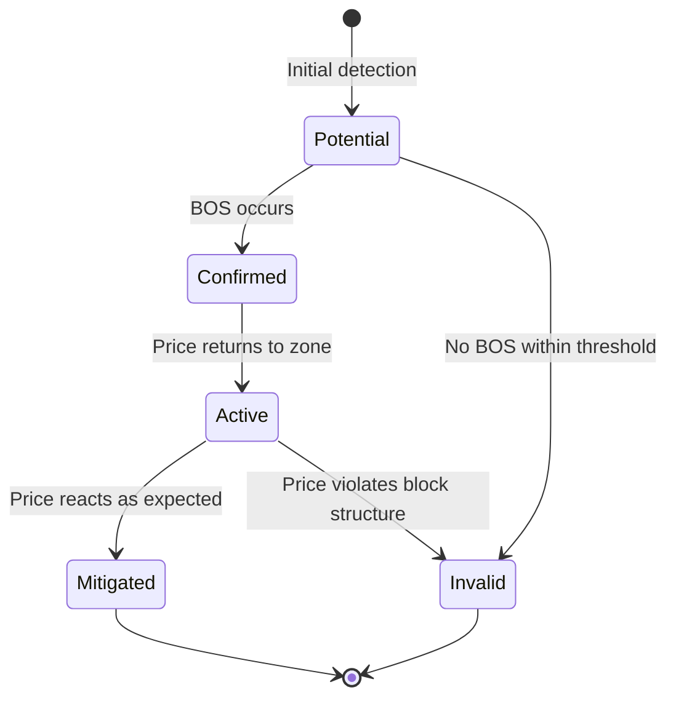

# Professional Order Block Detection Engine Design

## 1. Order Block Definition

### Institutional Definition
An order block represents a price zone where institutional traders have previously placed significant buy/sell orders, creating an imbalance in market structure. These zones become future reference points for price action.

### Bullish Order Block
- A consolidation zone preceding a strong upward move
- Represents institutional accumulation before markup
- Characterized by a base of support with subsequent break of structure

### Bearish Order Block
- A consolidation zone preceding a strong downward move
- Represents institutional distribution before markdown
- Characterized by a ceiling of resistance with subsequent break of structure

### Differentiation from Random S/R
- Must be confirmed by subsequent market structure break (BOS)
- Requires specific candle patterns (engulfing, large range)
- Needs validation through liquidity sweeps or CHOCH
- Has defined lifecycle states (active, mitigated, invalid)

## 2. Detection Algorithm

### Core Identification Logic
1. Identify swing points (using Swing Detector)
2. Locate consolidation zones preceding strong moves
3. Validate with subsequent BOS/CHOCH
4. Confirm with liquidity sweep patterns

### Confirmation Requirements
- Must have at least 3 touches (creation, retest, confirmation)
- Requires BOS within 3 candles after formation
- Needs volume confirmation (if available)
- Must respect market structure context

### Anti-Repainting Measures
- Only confirm blocks after BOS occurs
- Require minimum candle close beyond block boundaries
- Implement event-based rather than continuous evaluation
- Store historical blocks with immutable timestamps

## 3. Bullish Order Block Rules

### Conditions
1. Preceded by downtrend (confirmed by Swing Detector)
2. Consolidation zone with at least 3 candles
3. Engulfing or large bullish candle breaks consolidation
4. Subsequent BOS confirms bullish structure

### Candle Requirements
- Minimum range of 1.5x ATR(14)
- Close above 60% of candle range
- Higher volume than previous 5 candles (if available)

### Structure Requirements
- Must break previous swing low
- Should see liquidity sweep below block
- CHOCH should confirm trend reversal

## 4. Bearish Order Block Rules

### Conditions
1. Preceded by uptrend (confirmed by Swing Detector)
2. Consolidation zone with at least 3 candles
3. Engulfing or large bearish candle breaks consolidation
4. Subsequent BOS confirms bearish structure

### Candle Requirements
- Minimum range of 1.5x ATR(14)
- Close below 40% of candle range
- Higher volume than previous 5 candles (if available)

### Structure Requirements
- Must break previous swing high
- Should see liquidity sweep above block
- CHOCH should confirm trend reversal

## 5. Order Block Lifecycle



## 6. Data Model Design

```python
from dataclasses import dataclass
from datetime import datetime
from enum import Enum, auto
from typing import Optional, Tuple

class OrderBlockType(Enum):
    BULLISH = auto()
    BEARISH = auto()

class OrderBlockStatus(Enum):
    POTENTIAL = auto()
    CONFIRMED = auto()
    ACTIVE = auto()
    MITIGATED = auto()
    INVALID = auto()

@dataclass(frozen=True)
class OrderBlock:
    block_id: str  # UUID
    creation_time: datetime
    block_type: OrderBlockType
    price_range: Tuple[float, float]  # (low, high)
    swing_reference: float  # Relevant swing point
    bos_event_id: Optional[str] = None  # Linked BOS event
    choch_event_id: Optional[str] = None  # Linked CHOCH event
    liquidity_event_id: Optional[str] = None  # Linked liquidity event
    status: OrderBlockStatus = OrderBlockStatus.POTENTIAL
    expiration_time: Optional[datetime] = None
    invalidated_time: Optional[datetime] = None

@dataclass
class OrderBlockEvent:
    event_id: str
    block_id: str
    event_type: str  # "CREATED", "CONFIRMED", "MITIGATED", etc.
    event_time: datetime
    price: float
    additional_data: Optional[dict] = None
```

## 7. State Management

```python
@dataclass
class OrderBlockDetectorState:
    active_blocks: Dict[str, OrderBlock]  # Active order blocks by ID
    historical_blocks: Dict[str, OrderBlock]  # All blocks by ID
    swing_state: SwingDetectionState  # Consumed state
    bos_events: List[BOSEvent]  # Consumed events
    choch_events: List[CHOCHEvent]  # Consumed events
    liquidity_events: List[LiquidityEvent]  # Consumed events
    last_processed_time: datetime  # For idempotency
```

## 8. Detector Architecture

```python
class OrderBlockDetector:
    def __init__(self, config: OrderBlockConfig, initial_state: Optional[OrderBlockDetectorState] = None):
        self._config = config
        self._state = initial_state or OrderBlockDetectorState.empty()
        
    def update_swing_state(self, swing_state: SwingDetectionState) -> None:
        """Update internal swing state"""
        self._state.swing_state = swing_state
        
    def process_bos_event(self, event: BOSEvent) -> List[OrderBlockEvent]:
        """Process BOS events and return generated OB events"""
        # Implementation...
        
    def process_choch_event(self, event: CHOCHEvent) -> List[OrderBlockEvent]:
        """Process CHOCH events and return generated OB events"""
        # Implementation...
        
    def process_liquidity_event(self, event: LiquidityEvent) -> List[OrderBlockEvent]:
        """Process liquidity events and return generated OB events"""
        # Implementation...
        
    def process_candle(self, candle: CandleData) -> List[OrderBlockEvent]:
        """Process new candle and return generated OB events"""
        # Implementation...
        
    def get_state(self) -> OrderBlockDetectorState:
        """Get current detector state"""
        return deepcopy(self._state)
        
    def reset(self) -> None:
        """Reset detector to initial state"""
        self._state = OrderBlockDetectorState.empty()
        
    # Private methods would include:
    # _detect_potential_blocks
    # _confirm_blocks
    # _check_mitigation
    # _check_invalidation
    # _prune_expired_blocks
```

## 9. Backtesting Considerations

1. **Time-sequenced processing**: Ensure all events are processed in strict chronological order
2. **State snapshots**: Support saving/loading state for walk-forward optimization
3. **Event-based triggers**: Only generate signals when market events occur, not on every tick
4. **Deterministic behavior**: Same inputs must always produce same outputs
5. **Live trading compatibility**: Identical code paths for backtest and live trading

## 10. Testing Strategy

### Unit Tests
1. **Initialization**: Verify detector starts in correct state
2. **Reset**: Verify complete state clearance
3. **Bullish OB detection**: Validate all confirmation rules
4. **Bearish OB detection**: Validate all confirmation rules
5. **Invalid OB rejection**: Test false pattern rejection
6. **Mitigation**: Verify proper state transition
7. **Duplicate protection**: Test same block isn't detected twice
8. **Expiration**: Test time-based invalidation
9. **Structural violation**: Test invalidation on structure break

## 11. Architectural Recommendations

### Dependencies
- **Should consume BOS state**: Yes, critical for confirmation
- **Should consume CHOCH events**: Yes, as secondary confirmation
- **Should consume LiquiditySweep events**: Yes, for validation
- **Should own**: Only its detection logic and block state

### Integration Pattern
1. Make detector subscribe to:
   - Swing state updates (push)
   - BOS/CHOCH/Liquidity events (push)
   - Candle closes (push)
2. Emit OrderBlockEvents for downstream consumers
3. Keep state management internal
4. Make state serializable for persistence

### Performance Considerations
- Implement efficient range queries for block zones
- Use spatial indexing for active block lookup
- Limit historical block retention to relevant periods
- Consider incremental processing for high-frequency data

This design provides a robust, institutional-grade order block detection system that integrates properly with your existing architecture while maintaining clean separation of concerns and professional software engineering standards.